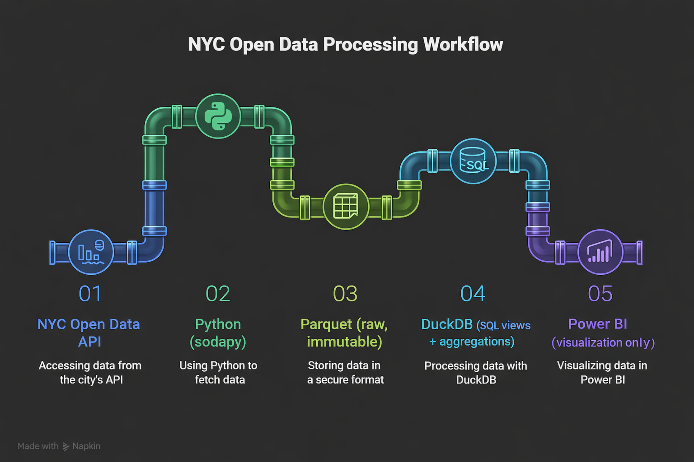

# LatencyAtlas  
**SLA compliance and response variability analysis using NYC 311 service requests**

A decision-oriented BI project analyzing SLA compliance and operational performance using real NYC 311 service request data.  
Built with API-driven ingestion and a modern analytics-first architecture.

## Project Objective

To evaluate operational efficiency and SLA adherence across NYC agencies using real, API-sourced data.  
The project is intentionally framed around analytical rigor, pushing heavy logic upstream and keeping BI tools focused on decision-making visuals.
This project prioritizes analytical correctness and governance over visual storytelling.

## Data Source

- Platform: NYC Open Data (Socrata)
- Dataset: 311 Service Requests
- Dataset ID: `erm2-nwe9`
- Access Method: Socrata API via Python (`sodapy`)
- Data Scope: Time-scoped operational slice (explicitly framed, not full historical analysis)
- Raw data is ingested via authenticated API access and stored without transformation.

## Architecture

## Repository layout

| Path | Purpose |
|------|---------|
| `api.py`, `dashboard.html` | Flask API and dashboard UI |
| `build.py`, `data_extract.py` | Parquet ingest and DuckDB build |
| `sql/` | Layered SQL views for DuckDB |
| `static/img/` | Dashboard images (served at `/static/img/…` when using `python api.py`) |
| `docs/images/` | README and doc assets |

## Storage Strategy

- Raw data stored in Parquet for columnar, compressed analytics
- Raw files treated as immutable
- CSV-based workflows intentionally avoided
- This ensures raw data can always be re-audited against derived analytics.

## Analytics Layer

- DuckDB used as the analytical SQL engine (OLAP)
- Parquet queried directly without import

Business logic is implemented upstream using layered SQL views:
- **Raw views**: faithful exposure of ingested data with no interpretation  
- **Normalization views**: controlled semantic mappings (e.g., status normalization)  
- **Eligibility views**: enforcement of SLA applicability rules  
- **SLA views**: fixed-threshold SLA classification and severity buckets  

Power BI consumes only curated views and does not define eligibility or SLA logic.

## Reproducibility (In Progress)

This project is designed to be fully reproducible from raw data ingestion to BI-ready analytics.

The intended workflow will include:
1. Environment-based API authentication
2. Deterministic data extraction to immutable Parquet
3. Automated construction of the DuckDB semantic layer via SQL scripts
4. Read-only BI consumption via ODBC

Detailed, step-by-step reproduction instructions will be added as the pipeline stabilizes.

## **👤 Author**

**Rehan Abdul Gani Shaikh**  
**Data Science & ML Student | Python • Power BI | Building Real-World Data Projects**

🔗 Connect with me:  [LinkedIn](https://www.linkedin.com/in/rehan-shaikh-68153a246)  

📬 Email: rehansk.3107@gmail.com
